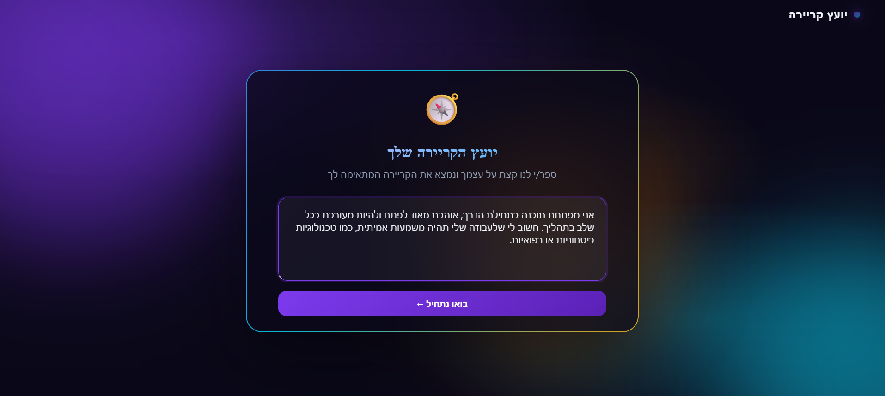
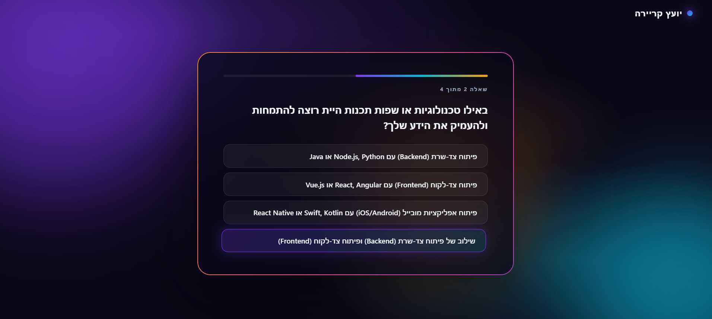
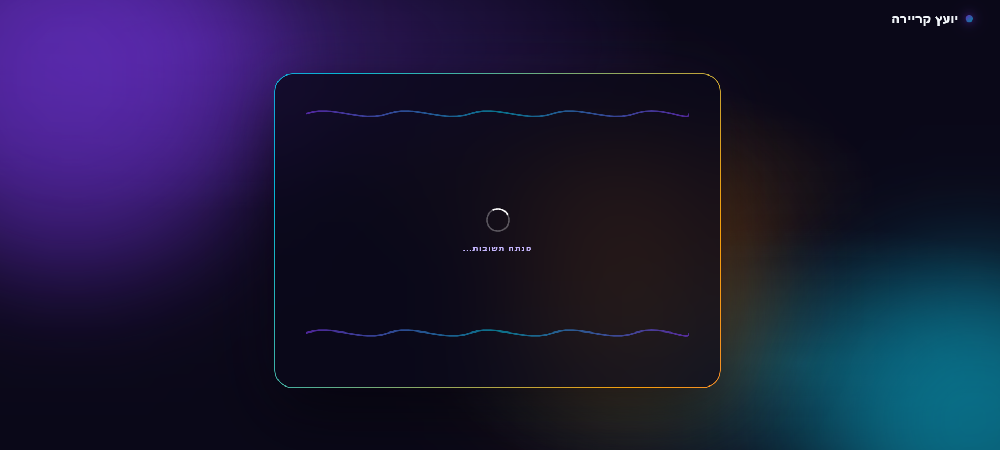
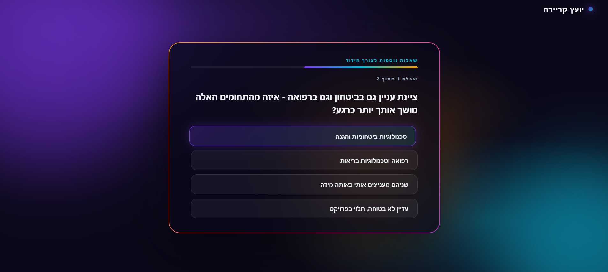
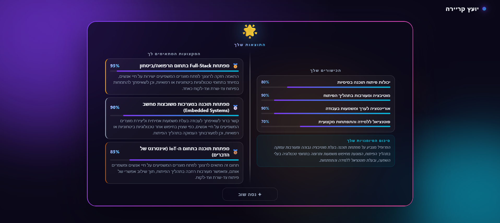

# AI Career Advisor

An AI-powered career recommendation system that dynamically generates personalized questions and analyzes user responses to suggest the most suitable career directions.

---

## About The Project

Most career tools rely on fixed questionnaires that treat every user the same. This project takes a different approach — instead of static logic, it uses AI to adapt both the questions and the final recommendation to each individual user.

The user describes themselves in free text, and the system takes it from there: generating targeted diagnostic questions, evaluating whether the answers are sufficient, extracting skills with confidence scores, and finally running an AI agent that produces three ranked career recommendations with personalized reasoning.

The goal is to demonstrate how AI can be integrated into a software system to create adaptive, personalized decision-support experiences based on user context.

---

## Screenshots

### User Input


### AI Generated Question


### AI Analysis


### Clarifying Question


### Career Recommendations


---

## How It Works

1. The user enters a free-text self-description (background, interests, skills).
2. The AI generates 4 personalized multiple-choice questions targeting key career dimensions: motivation, skills, constraints, and career direction.
3. If the answers are insufficient, the system automatically generates up to 2 follow-up rounds of 2 additional questions each.
4. Once enough information is collected, an AI agent extracts the user's skills with confidence scores, then produces 3 ranked career recommendations with match percentages and personalized reasoning.

---

## Features

- Free-text input — no forms or fixed categories
- AI-generated diagnostic questions tailored to each user
- Adaptive follow-up rounds when answers are insufficient
- Skill extraction with confidence scores (0–1)
- 3 ranked career recommendations with match percentages
- Confetti + sound effect on result reveal
- Session persistence via a local JSON file (auto-cleaned after 2 hours)
- Automatic fallback to a secondary Gemini model on 503 errors

---

## Tech Stack

| Layer    | Technology                          |
|----------|-------------------------------------|
| Frontend | React, JavaScript (JSX)             |
| Backend  | Node.js, Express, TypeScript        |
| AI       | Google Gemini API (`@google/genai`) |
| Storage  | JSON file (`db.json`) — no database |

---

## Project Structure

```
ai_career_advisor/
├── frontend/
│   └── src/
│       ├── components/           # UserInputCard, QuestionCard, ResultCard, Confetti
│       ├── services/api.js       # API calls to backend
│       └── App.js                # Main app state and flow
└── backend/
    └── src/
        ├── config/               # Gemini client config
        ├── controllers/          # ai.controller.ts, agent.controller.ts
        ├── db/                   # db.service.ts — JSON read/write/cleanup
        ├── routes/               # ai.routes.ts
        ├── services/             # ai.service.ts, agent.service.ts
        ├── tool/                 # extractSkills tool (definition + handler + registry)
        ├── types/                # Shared TypeScript interfaces
        └── utils/prompt.util.ts  # All AI prompt builders
```

---

## AI Architecture

The system uses the **Google Gemini API** across five distinct AI flows:

| Flow | Description |
|------|-------------|
| Question generation | Generates 4 diagnostic questions covering motivation, skills, constraints, and career direction |
| Sufficiency check | Evaluates whether collected answers are sufficient for a confident recommendation |
| Follow-up questions | Generates 2 targeted follow-up questions when more information is needed (up to 2 rounds) |
| Skill extraction | Extracts 3–5 skills with confidence scores from the user's text and answers |
| Career agent | An agentic loop that calls `get_session` as a tool, then produces 3 ranked career recommendations |

The default model is `gemini-2.5-flash-lite`, with automatic fallback to `gemini-2.5-flash` on 503 errors.

---

## API Endpoints

| Method | Endpoint | Description |
|--------|----------|-------------|
| `POST` | `/api/questions/generate` | Generate 4 questions from free text; creates a session |
| `POST` | `/api/profession/match` | Submit answers; returns follow-up questions or triggers skill extraction |
| `POST` | `/api/agent/recommend` | Run the career agent; returns 3 ranked recommendations |

---

## Getting Started

### Prerequisites

- Node.js 18+
- A [Google Gemini API key](https://aistudio.google.com/app/apikey)

### Installation

```bash
# Install root dependencies (concurrently)
npm install

# Install backend dependencies
cd backend && npm install

# Install frontend dependencies
cd frontend && npm install
```

### Environment Variables

**`backend/.env`**
```env
GEMINI_API_KEY=your_gemini_api_key_here
GEMINI_MODEL=gemini-2.5-flash-lite
GEMINI_FALLBACK_MODEL=gemini-2.5-flash
PORT=5000
CLIENT_ORIGIN=http://localhost:3000
```

**`frontend/.env`**
```env
REACT_APP_API_URL=http://localhost:5000/api
```

### Run Locally

```bash
# From the project root — starts both frontend and backend
npm run dev
```

- Frontend: `http://localhost:3000`
- Backend: `http://localhost:5000`

---

## Future Improvements

- Replace `db.json` with a real database (e.g. PostgreSQL or MongoDB)
- Add user authentication to persist history across sessions
- Support multiple languages beyond Hebrew
- Export results as PDF
